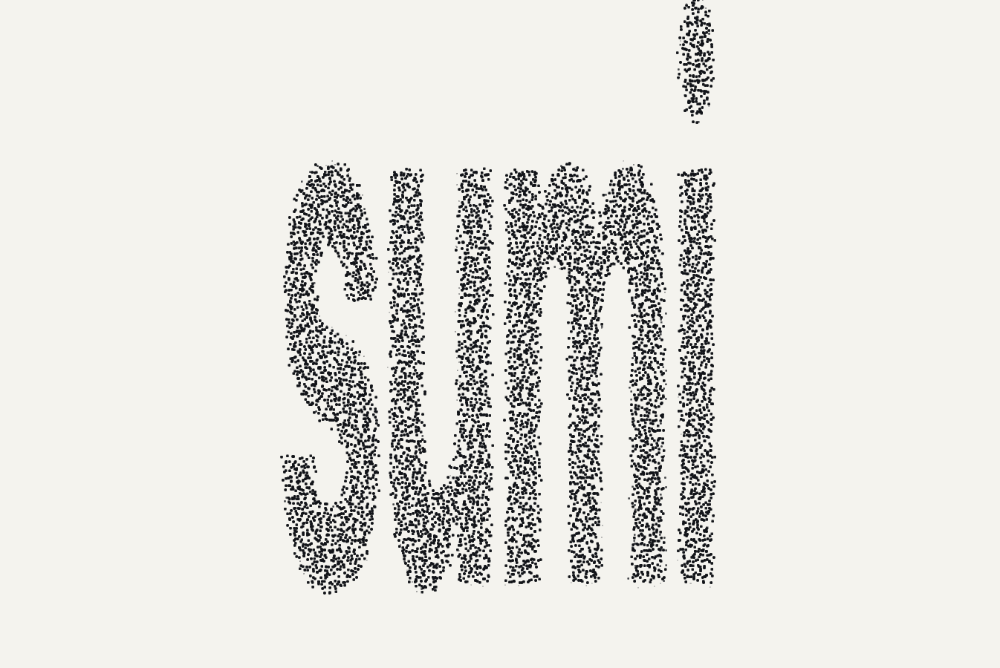

# sumi

> Cinematic **ink sand-painting** particle layer for hero sections and decks — turn any image or text into a field of ink stipple that coalesces, morphs, disperses, and tilts in 3D to the cursor. Zero dependencies.



`sumi` (墨) samples an image, word, SVG path, or procedural shape into thousands of ink-colored particles on a single `<canvas>`, then choreographs them between formations. Formations carry real depth, so the field reads as a solid that tilts to the cursor — perspective and rotation, still on plain canvas2d. It's built for the moments a deck or landing page wants to feel alive — a title that assembles from dust, a key number that punches in, an image that drifts into being — without pulling in a framework or a WebGL stack.

## Why sumi

Five things no existing particle library ships together:

- **Image-sampled ink-stipple aesthetic** — warm-white paper, ink grains; not another twinkly tech-blue background.
- **Formation-morph choreography** — the whole field morphs between named formations (text → image → shape → volumetric column) on a timeline, not just ambient drift.
- **True-3D depth on canvas2d** — formations carry a `z` axis; the field projects in perspective and tilts to the cursor (a fixed oblique in static mode), reading as a rotating volumetric solid — no WebGL. On by default; `tilt: false` opts out.
- **Zero-dependency, single-file canvas2d** — one `<script>`, no build, no WebGL, ~8 KB gzip. Drop it into any HTML deck or page.
- **Reduced-motion / mobile static fallback baked in** — accessibility is the default, not a chore. Titles hand off to real, selectable `<h1>` text.

## Quickstart

```html
<canvas id="ink" style="position:fixed;inset:0;width:100%;height:100%;pointer-events:none"></canvas>
<h1 id="title" style="opacity:0">Ink in Motion</h1>

<script src="dist/index.global.js"></script>
<script>
  // particles assemble into the title, then hand off to the crisp <h1>
  Sumi.textReveal(document.getElementById('ink'), document.getElementById('title'), {
    text: 'Ink in Motion',
    shape: 'round',   // 'square' | 'round' | 'soft'
  });
</script>
```

Or declarative — let `sumi` wire it from attributes:

```html
<h1 data-ink="title">Ink in Motion</h1>
<script src="dist/index.global.js"></script>
<script>Sumi.autoInit(document);</script>
```

Your real workflow — **generate an image with AI, then particle-ize it:**

```js
const img = new Image();
img.onload = () => Sumi.imageReveal(canvas, img, { shape: 'round' });
img.src = 'your-ai-generated-image.png';
```

## Particle shapes

`square` (crisp, pixel energy) · **`round`** (default — clean ink stipple) · `soft` (feathered, watercolor feel). Rendered via cached per-level sprites, so round/soft cost no more than squares.

## 3D depth

Persisting fields (`sceneMorph`, `imageReveal`, and the `column` / `fromPoints3d` forms) are volumetric by default: every particle carries a `z`, the field is projected in perspective, and it **tilts toward the cursor** — near grains darken and grow, far grains fade — so a flat silhouette reads as a rotating solid. `textReveal` stays flat, since it hands off to crisp DOM text.

```js
const rng = Sumi.createRng(303);
// disperse a 3D cloud, then assemble it into a solid vertical cylinder
const cloud = Array.from({ length: 8000 }, () => ({
  x: (rng() - 0.5) * 0.7, y: (rng() - 0.5) * 0.7, z: (rng() - 0.5) * 0.5,
  lvl: Math.floor(rng() * 24),
}));
const cylinder = Sumi.column(8000, { height: 0.72, radius: 0.18 }, rng);
Sumi.sceneMorph(canvas, { from: cloud, to: cylinder, n: 8000, seed: 303 });
```

Opt out per component with `tilt: false`, or tune it: `tilt: { maxYaw, maxPitch, smoothing, staticYaw, staticPitch }`. Reduced-motion and mobile render a single fixed-oblique frame instead of tracking the cursor.

## API

| Export | What |
|---|---|
| `textReveal(canvas, h1, opts)` | particles form text → hand off to a crisp, selectable `<h1>` |
| `imageReveal(canvas, img, opts)` | sample an image (AI-generated or any) into a persisting particle field |
| `sceneMorph(canvas, opts)` | morph the field between two formations (`from` → `to`) |
| `coverReveal(canvas, opts)` | wordmark + tagline cover preset |
| `statReveal(canvas, el, opts)` | a big number that assembles then counts up |
| `fromText` / `fromImage` / `fromSVGPath` / `fromShape` | build a 2D formation (`Pt[]`) from a source |
| `column(n, opts, rng)` / `fromPoints3d(pts3d, n, rng)` | build a **volumetric** formation — a solid cylinder (body of revolution), or resampled arbitrary 3D points (each carries `z`) |
| `autoInit(root)` / `parseInkAttributes(root)` | declarative `data-ink-*` wiring |
| `createRng(seed)` | seeded RNG — same seed → identical render |
| `recommendedParticleCount({width, dpr})` | adaptive particle budget (capped at 15k) |
| `InkStage` | `morph` / `snapshotFor` / `isStatic` / `destroy` — the runtime each component returns; drives the default 3D `tilt` (opt out with `tilt: false`) |

Particle count, palette, shape, and seed are all configurable; the canvas is auto-sized to its CSS box (with resize handling).

## Try it

```bash
git clone https://github.com/alextangson/sumi
cd sumi
npm install
npm run build      # emits dist/ (ESM + IIFE global `Sumi` + types), enforces the <25 KB gzip budget
npm test           # the deterministic engine test suite
```

Then open:
- **`playground/index.html`** — drop an image or type text, tune shape / count / seed live.
- **`demo/gallery.html`** — a showcase of every component.
- **`demo/single-file-deck.html`** — a self-contained particle deck; opens directly by double-click, no build required (← / → to navigate, ⌘P to print).
- **`skill/`** — an Agent Skill that teaches Claude (or any coding agent) to generate HTML decks in this style.

> npm: the name `sumi` is taken on npm, so the published package will be scoped (e.g. `@alextangson/sumi`). For now, clone + build.

## Accessibility & performance

Real text stays in the DOM (titles hand off to a selectable `<h1>`; decorative canvases are `aria-hidden`). `prefers-reduced-motion` and small/mobile viewports auto-render a single static frame. Color-bucket batching + sprite caching keep ~15k particles smooth on a single canvas; the rAF loop pauses when hidden. See [docs/performance.md](docs/performance.md).

## Framework adapters

Thin wrappers for React, Vue, Svelte, plus a reveal.js helper and a Slidev layer — see [adapters/README.md](adapters/README.md).

## License

MIT © 2026 Jiaxin Tang
